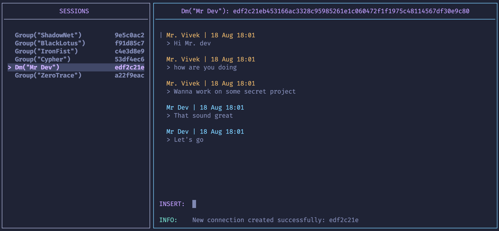

# null-talk 🛡️

**High-Performance Secure Chat with Double Encryption & Vim-inspired TUI**

`null-talk` is a secure-by-design messaging system built in Rust. It utilizes a custom binary protocol, RSA challenge-response authentication, and double-layer encryption to ensure end-to-end privacy. The system is designed to be ephemeral, meaning no message data is ever persisted to a database; the server acts strictly as a secure relay.

---

## 🚀 Installation

### 1. Download Binaries

You can download the pre-compiled binaries for your specific operating system and architecture from the official releases page:
👉 **[Download null-talk Releases](https://github.com/ByteMaster2003/null-talk/releases)**

**Supported Binaries:**

- **Linux:** `x86_64` and `arm64`
- **macOS:** Universal binary (Intel/Apple Silicon)
- **Windows:** `x86_64` `.exe`

### 2. Manual Build

If you prefer to build from source, ensure you have the Rust environment installed:

```bash
git clone https://github.com/ByteMaster2003/null-talk.git
cd null-talk
cargo build --release --workspace
```

---

### 🔑 Prerequisites

#### RSA Key Generation

To use the client, you must have an **OpenSSH RSA** private key. This is used for the cryptographic challenge-response handshake that verifies your identity.

#### Generate a compatible keypair using:

```
ssh-keygen -t rsa -b 4096 -m PEM -f ./id_rsa
```

#### TLS Certificates (Server Only)

If you plan to run the server in TLS mode, you must have valid Let's Encrypt certificates located at:

- `/etc/letsencrypt/live/{your-domain}/fullchain.pem`
- `/etc/letsencrypt/live/{your-domain}/privkey.pem`

### 🖥️ How to Run the Server

```
./null-talk-server --port [PORT] --domain [OPTIONAL_DOMAIN]
```

- **Standard Mode:** Defaults to port 8080.
- **TLS Mode:** If --domain is provided, the server attempts to load Let's Encrypt certificates from:
  - `/etc/letsencrypt/live/{domain}/fullchain.pem`
  - `/etc/letsencrypt/live/{domain}/privkey.pem`
- **Note:** The server will panic if a domain is specified but certificates are missing.
- **Logging:** Current version logs client connection and disconnection events only.

### ⌨️ How to Use the Client Application

The client features a terminal UI (TUI) with a layout inspired by Vim.

```
./null-talk-client --host [IP:PORT] --key-path [PATH_TO_PRIVATE_KEY] --tls [true/false]
```

**TUI Interface & Controls**


The UI is divided into a **Side Panel** (Users/Rooms) and a **Main Panel** (Chat Window).
| Mode | Triggger | Description |
|-------|-----|-----------|
| NORMAL | Esc | Default mode. Use Arrow Keys to switch focus between panels. |
| COMMAND | / | Enter system-level commands. |
| INSERT | i | Compose and send messages. |

- **Navigation:** Follows Vim-style logic for switching modes and interacting with the UI.
- **Feedback:** Errors or status updates are displayed at the bottom of the Main Panel.

### 🔐 Security Overview

- **RSA Challenge-Response:** Authentication happens without ever sending your actual key or password over the wire.
- **Double Encryption:** Messages are encrypted at the payload level before transport, ensuring the server cannot read your content.
- **Ephemeral:** Data exists only in RAM and vanishes the moment the session ends.
